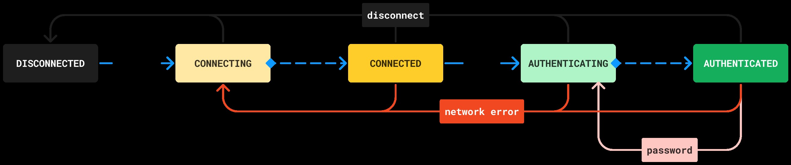

# Jarcon

**Jarcon** is a remote console client for Frostbite games, originally developed for *The Last Refuge*.<br>It implements the official DICE protocol specification found [here](https://github.com/TheLastRefuge/Jarcon/blob/dev/BF3%20PC%20Server%20Remote%20Administration%20Protocol.pdf) and is easily extensible for [modded servers](https://veniceunleashed.net).

## Overview


The JarconClient lifecycle is implemented as a **state machine**. The current state is readable via `client.getState()`.

Every client starts in the `DISCONNECTED` state, where a `client.connect()` call transitions into `CONNECTING`.
In the `CONNECTING` state, a worker continually tries to reach the server every `client.getSettings().reconnectDelay()` milliseconds,
until the `CONNECTED` state is reached. From thereon, either a `client.login()` call or `client.getSettings().autoLogin() == true` will cause another worker to try logging in (`AUTHENTICATING`), until finally reaching the `AUTHENTICATED` state, from which all actions are permitted.

In the event of a network error, we fall back into `CONNECTING` to try and reconnect. Outstanding packets will complete exceptionally.

If the server password changes (see `client.adminPassword(String)`), we have no choice but to return into `AUTHENTICATING`. Ideally, the password should be updated accordingly via `client.setPassword(String)`.

Additionally, the client may be *closed* (see below), to prevent more actions from being queued when your application shuts down.
## Setup
```java
//Create client
InetSocketAddress address = new InetSocketAddress(Inet4Address.getByName(IP), PORT);
BF3Client client = new BF3Client(address, PASSWORD);

//Configure
client.getSettings.autoLogin(true);
client.getSettings.shutdownTimeout(5000);

//Connect
client.connect(); //CompletableFuture<Void>

/* Commands may be queued here before future is completed */

//Once we are done, close client
//Waiting for quiescence up to 5 seconds
client.close();
```

## Command Usage

There are a variety of ways to run commands based on your use case:
```java
//Non-blocking
client.serverInfo().queue() //CompletableFuture<BF3ServerInfo>
        .orTimeout(2, TimeUnit.SECONDS)
        .thenAccept(info -> System.out.println(info.name()));

//Non-blocking with error handler
client.serverInfo().queue(info -> System.out.println(info.name()), throwable -> {
    if(throwable.getCause() instanceof ErrorResponseException ere) {
        System.err.println(ere.getFrostbiteError());
    }
});
        
//Blocking
try {
    System.out.println(client.serverInfo().complete().name());
} catch (ExecutionException e) {
    if(e.getCause() instanceof ErrorResponseException ere) {
        System.err.println(ere.getFrostbiteError());
    }
} catch (InterruptedException e) {}
```
## Event Usage
To receive server events, use either `client.getSettings().eventsEnabled(true)` before connecting, or `client.eventsEnabled(true).queue()` thereafter. They are disabled by default to save bandwidth. Once events are enabled, you may register arbitrary listeners as such:
```java
//Each BF3EventHandler contains a ThreadPool for dispatching events to multiple listeners registered to it
final BF3EventHandler handler = new BF3EventHandler();

//The client's MetaHandler dispatches to all our EventHandlers like the one above
client.getMetaHandler().registerListener(handler);

//Now we can register arbitrary listeners to our EventHandler
handler.registerListener(new BF3EventListener() {
    @Override
    public void onJoin(String name, UUID guid) {
        System.out.println(name + " joined the server!");
    }
    
    @Override
    public void onKill(String killer, String victim, String weapon, boolean headShot) {
        if(isAdmin(victim) && !isAdmin(killer)) client.kickPlayer(killer).queue(); // ( ͡° ͜ʖ ͡°)
    }
});
```

## Error Handling
All uncaught exceptions thrown within callbacks passed to non-blocking methods are forwarded to the bound SLF4J logger. Same for uncaught exceptions in event listeners, or any other internal threads for that matter. If an exception was caused by the server, it is wrapped in an [`ErrorResponseException`](https://github.com/TheLastRefuge/Jarcon/blob/dev/src/main/java/gg/tlr/jarcon/core/ErrorResponseException.java) and potentially resolved to a [`FrostbiteError`](https://github.com/TheLastRefuge/Jarcon/blob/dev/src/main/java/gg/tlr/jarcon/frostbite/FrostbiteError.java).

If you are running a modded server or discover undocumented frostbite errors, you may define new ones like so:
````java
enum CustomError implements RemoteError {
    MY_MOD_ERROR("MyModError"),
    UNDOCUMENTED_FROSTBITE_ERROR("FunnyErrorWeForgotAbout");

    private final String id;

    CustomError(String id) {
        this.id = id;
    }

    @Override
    public String getId() {
        return id;
    }

    @Override
    public String getProviderName() {
        return "ExampleMod";
    }
}
````
````java
client.registerErrors(CustomError.class);
````